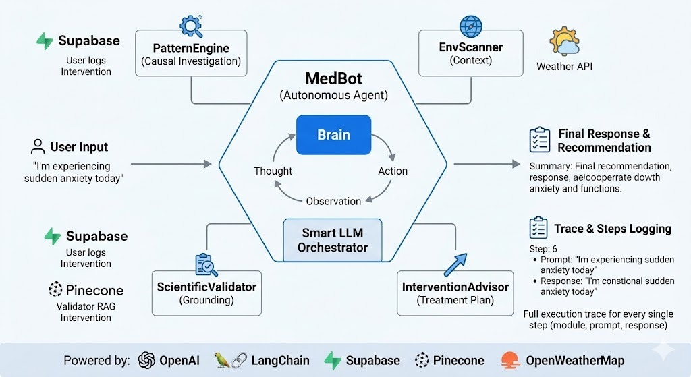

# MedBot: Holistic Symptom Navigator & Medical AI Agent

## Description
MedBot is an autonomous AI agent designed to analyze user health logs, environmental data, and scientific medical literature to provide evidence-based, holistic insights into symptoms and well-being. This project was developed to demonstrate state-of-the-art AI agent architecture, reasoning capabilities, and an API-first design.

## Live Demo
* Web UI & API Base URL: https://medbot-7e2q.onrender.com
* API Documentation (Swagger): https://medbot-7e2q.onrender.com/docs

## Architecture & Tech Stack
The agent utilizes a multi-step reasoning approach, retrieving personal context, scanning environmental factors, and validating against scientific abstracts before generating a final response. 

* Backend Framework: FastAPI (Python)
* LLM Provider: LLMod.ai
* Vector Database: Pinecone (for medical literature chunking & retrieval)
* Primary Database: Supabase (for user health logs)
* Deployment: Render

## API Endpoints
The system exposes the following endpoints as required by the project specifications:
* GET /api/team_info - Returns student details and group information.
* GET /api/agent_info - Returns the agent's meta-data, purpose, prompt templates, and usage examples.
* GET /api/model_architecture - Returns the architecture diagram as a PNG image.
* POST /api/execute - The main entry point for the agent. Accepts a user prompt and returns the full reasoning trace (steps) and the final response.

## Web Interface
The project includes a minimal web UI served at the root URL (/). It provides a text area for prompt input, a "Run Agent" button, and dynamically displays both the final response and the step-by-step reasoning trace (module, prompt, response).

## Local Installation
1. Clone the repository:
   git clone https://github.com/fireflyOr/MedBot.git
   cd MedBot

2. Create a virtual environment and install dependencies:
   python -m venv .venv
   source .venv/Scripts/activate  # On Windows
   pip install -r requirements.txt

3. Set up Environment Variables:
   Create a .env file in the root directory and add the required keys:
   LLMOD_AI_API_KEY=your_key
   PINECONE_API_KEY=your_key
   SUPABASE_URL=your_url
   SUPABASE_KEY=your_key

4. Run the server:
   uvicorn main:app --reload